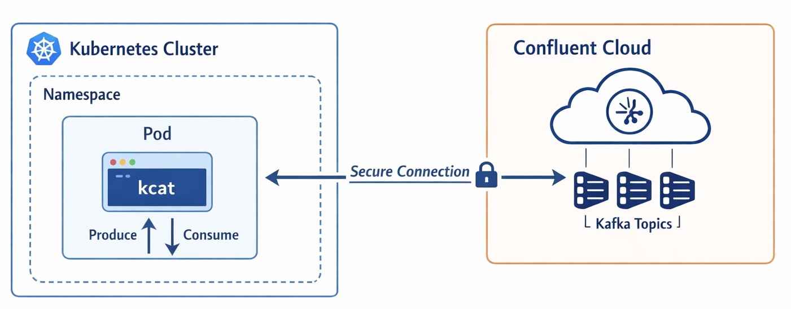

# Testing Confluent Cloud Connectivity from Kubernetes using kcat

## Overview

This guide demonstrates how to test network connectivity and authentication from a Kubernetes cluster (such as AWS EKS) to a Confluent Cloud Kafka cluster using a lightweight containerized tool called **kcat** (formerly known as kafkacat).



## Purpose

When deploying applications like Confluent Platform for Apache Flink on Kubernetes that need to connect to Confluent Cloud, it's critical to validate:

1. **Network Connectivity**: Can pods in your Kubernetes cluster reach the Confluent Cloud bootstrap servers?
2. **Firewall Rules**: Are the necessary outbound ports (9092, 443) open?
3. **Authentication**: Are your API keys valid and have the correct permissions?
4. **Topic Access**: Can you successfully list topics and consume/produce messages?

This simple test pod provides a fast, lightweight way to validate these prerequisites before deploying more complex applications.

## What is kcat?

**kcat** (formerly kafkacat) is a command-line utility that serves as a producer and consumer for Apache Kafka. It's particularly useful for:

- Testing connectivity and authentication
- Debugging Kafka issues
- Exploring topic metadata
- Quick message consumption/production
- Integration with shell scripts and CI/CD pipelines

The `edenhill/kcat` Docker image is minimal (~50MB) compared to full Kafka distributions (350MB+), making it ideal for quick connectivity tests.

## Prerequisites

- **Kubernetes cluster** (AWS EKS, Azure AKS, GKE, or local cluster like minikube/kind)
- **kubectl** CLI installed and configured to access your cluster
- **Confluent Cloud cluster** or any Kafka cluster with SASL/SSL authentication
- **API Keys** with appropriate permissions (read access to at least one topic)
- **Bootstrap server URL** from your Confluent Cloud cluster
- **Topic name** to test with (ensure the API key has permissions to access it)

## Files

This guide uses the following files:

- `kafka-connectivity-test-pod.yaml` - Kubernetes Pod manifest
- `kafka-connectivity-test-configmap.yaml` - ConfigMap for non-sensitive configuration
- `kafka-connectivity-test-secret.yaml` - Secret for sensitive credentials

## Step-by-Step Instructions

### Step 1: Obtain Confluent Cloud Credentials

Before proceeding, gather the following information from your Confluent Cloud console:

1. **Bootstrap Server URL**
   - Navigate to: Cluster → Cluster Settings → Endpoints
   - Example format: `pkc-xxxxx.us-east-1.aws.confluent.cloud:9092`

2. **API Key and Secret**
   - Navigate to: Cluster → API Keys → Add Key
   - Create a key with appropriate ACLs (minimum: read access to a test topic)
   - **Important**: Save the API Secret immediately - it won't be shown again

3. **Topic Name**
   - Use an existing topic or create a new one for testing
   - Ensure your API key has permissions to access this topic

### Step 2: Prepare the ConfigMap

Create a file named `kafka-connectivity-test-configmap.yaml`:

```yaml
apiVersion: v1
kind: ConfigMap
metadata:
  name: kafka-test-config
  namespace: default
data:
  # REPLACE: Your Confluent Cloud bootstrap server
  bootstrap.servers: "pkc-xxxxx.us-east-1.aws.confluent.cloud:9092"

  # REPLACE: Your topic name to test with
  topic.name: "your-topic-name"
```

**⚠️ Action Required**: Edit the file and replace:
- `pkc-xxxxx.us-east-1.aws.confluent.cloud:9092` → Your actual bootstrap server URL
- `your-topic-name` → Your actual topic name

### Step 3: Prepare the Secret

Create a file named `kafka-connectivity-test-secret.yaml`:

```yaml
apiVersion: v1
kind: Secret
metadata:
  name: kafka-test-credentials
  namespace: default
type: Opaque
stringData:
  # REPLACE: Your Confluent Cloud API Key
  api.key: "YOUR_API_KEY_HERE"

  # REPLACE: Your Confluent Cloud API Secret
  api.secret: "YOUR_API_SECRET_HERE"
```

**⚠️ Action Required**: Edit the file and replace:
- `YOUR_API_KEY_HERE` → Your actual API Key
- `YOUR_API_SECRET_HERE` → Your actual API Secret

**🔒 SECURITY WARNING**:
- **DO NOT commit this file to version control** with real credentials
- Add `*-secret.yaml` to your `.gitignore` file
- Consider using tools like `sealed-secrets` or external secret managers for production use

### Step 4: Prepare the Pod Manifest

Create a file named `kafka-connectivity-test-pod.yaml`:

```yaml
apiVersion: v1
kind: Pod
metadata:
  name: kafka-connectivity-test
  namespace: default
  labels:
    app: kafka-test
    purpose: connectivity-validation
spec:
  containers:
  - name: kcat
    image: edenhill/kcat:1.7.1
    # Keep the pod running so we can exec into it
    command: ["sh", "-c", "sleep 600000"]
    env:
    - name: BOOTSTRAP_SERVERS
      valueFrom:
        configMapKeyRef:
          name: kafka-test-config
          key: bootstrap.servers
    - name: TOPIC_NAME
      valueFrom:
        configMapKeyRef:
          name: kafka-test-config
          key: topic.name
    - name: SASL_USERNAME
      valueFrom:
        secretKeyRef:
          name: kafka-test-credentials
          key: api.key
    - name: SASL_PASSWORD
      valueFrom:
        secretKeyRef:
          name: kafka-test-credentials
          key: api.secret
    resources:
      requests:
        memory: "64Mi"
        cpu: "100m"
      limits:
        memory: "128Mi"
        cpu: "200m"
  restartPolicy: Never
```

**No changes needed** - this file references the ConfigMap and Secret created in previous steps.

### Step 5: Deploy to Kubernetes

Apply the manifests in order:

```bash
# 1. Create the ConfigMap
kubectl apply -f kafka-connectivity-test-configmap.yaml

# 2. Create the Secret
kubectl apply -f kafka-connectivity-test-secret.yaml

# 3. Create the Pod
kubectl apply -f kafka-connectivity-test-pod.yaml

# 4. Wait for the pod to be ready
kubectl wait --for=condition=Ready pod/kafka-connectivity-test --timeout=60s

# 5. Verify the pod is running
kubectl get pod kafka-connectivity-test
```

Expected output:
```
NAME                       READY   STATUS    RESTARTS   AGE
kafka-connectivity-test    1/1     Running   0          10s
```

### Step 6: Test Connectivity

#### Test 1: List Cluster Metadata

This validates basic connectivity and authentication:

```bash
kubectl exec -it kafka-connectivity-test -n default -- sh -c '
  kcat -b $BOOTSTRAP_SERVERS \
    -X security.protocol=SASL_SSL \
    -X sasl.mechanism=PLAIN \
    -X sasl.username=$SASL_USERNAME \
    -X sasl.password=$SASL_PASSWORD \
    -L
'  
```

**Expected output**: Metadata showing brokers, topics, partitions, and replication info.

#### Test 2: List All Topics

```bash
kubectl exec -it kafka-connectivity-test -n default -- sh -c '
  kcat -b $BOOTSTRAP_SERVERS \
    -X security.protocol=SASL_SSL \
    -X sasl.mechanism=PLAIN \
    -X sasl.username=$SASL_USERNAME \
    -X sasl.password=$SASL_PASSWORD \
    -L | grep topic
'
```

**Expected output**: List of topics with partition counts.

#### Test 3: Consume Messages from a Topic

Consume up to 10 messages from the beginning of the topic:

```bash
kubectl exec -it kafka-connectivity-test -n default -- sh -c '
  kcat -b $BOOTSTRAP_SERVERS \
    -X security.protocol=SASL_SSL \
    -X sasl.mechanism=PLAIN \
    -X sasl.username=$SASL_USERNAME \
    -X sasl.password=$SASL_PASSWORD \
    -t $TOPIC_NAME \
    -C \
    -c 10 \
    -o beginning
'
```

**Expected output**: Up to 10 messages from the topic (if messages exist).

**kcat flags explained**:
- `-C`: Consumer mode
- `-c 10`: Consume maximum 10 messages then exit
- `-o beginning`: Start from the beginning of the topic
- `-e`: Exit after reaching end of partition (optional)

#### Test 4: Interactive Shell (Optional)

For more exploration, get a shell inside the pod:

```bash
kubectl exec -it kafka-connectivity-test -n default -- sh
```

Once inside, you can run kcat commands directly:

```sh
# Example: Tail messages in real-time
kcat -b $BOOTSTRAP_SERVERS \
  -X security.protocol=SASL_SSL \
  -X sasl.mechanism=PLAIN \
  -X sasl.username=$SASL_USERNAME \
  -X sasl.password=$SASL_PASSWORD \
  -t $TOPIC_NAME \
  -C

# Press Ctrl+C to exit
# Type 'exit' to leave the pod shell
```

### Step 7: Cleanup

When finished testing, remove all resources:

```bash
# Delete the pod
kubectl delete pod kafka-connectivity-test -n default

# Delete the secret (recommended for security)
kubectl delete secret kafka-test-credentials -n default

# Delete the ConfigMap
kubectl delete configmap kafka-test-config -n default
```

Or delete all at once:

```bash
kubectl delete -f kafka-connectivity-test-pod.yaml
kubectl delete -f kafka-connectivity-test-secret.yaml
kubectl delete -f kafka-connectivity-test-configmap.yaml
```

## Troubleshooting

### Pod is in CrashLoopBackOff or Error state

**Check pod logs**:
```bash
kubectl logs kafka-connectivity-test
kubectl describe pod kafka-connectivity-test
```

**Common causes**:
- ConfigMap or Secret not created before the pod
- Typo in ConfigMap/Secret names or keys

### Connection timeout errors

**Error**: `%ERROR: Failed to acquire metadata: Local: Timed out`

**Possible causes**:
1. **Network connectivity issue**: Firewall blocking outbound traffic on port 9092
2. **Incorrect bootstrap server URL**: Verify the URL in your ConfigMap

**Debug steps**:
```bash
# Test basic network connectivity
kubectl exec -it kafka-connectivity-test -n default -- sh -c 'nc -zv pkc-xxxxx.us-east-1.aws.confluent.cloud 9092'

# Test DNS resolution
kubectl exec -it kafka-connectivity-test -- sh -c 'nslookup pkc-xxxxx.us-east-1.aws.confluent.cloud'
```

### Authentication errors

**Error**: `%ERROR: Authentication failed: Broker: Request was for an invalid api key`

**Possible causes**:
1. **Incorrect API Key or Secret**: Verify credentials in your Secret
2. **API Key lacks permissions**: Ensure key has ACLs for the topic
3. **API Key not activated**: Wait a few seconds after creating a new key

**Verify secret contents**:
```bash
kubectl get secret kafka-test-credentials -n default -o jsonpath='{.data.api\.key}' | base64 -d

# Should show your API key (without newline)
```

### Topic authorization errors

**Error**: `%ERROR: Topic authorization failed`

**Solution**: Ensure your API Key has ACLs granting read/write access to the topic. In Confluent Cloud:
1. Navigate to: Cluster → API Keys → Your Key → Edit Permissions
2. Add ACL: Topic `your-topic-name`, Operation `READ` (and `WRITE` if producing)

## Security Best Practices

1. **Never commit secrets to version control**
   - Add `*-secret.yaml` to `.gitignore`
   - Use secret templates with placeholder values for version control

2. **Use Kubernetes native secret management**
   - Consider using `kubectl create secret` instead of YAML files:
     ```bash
     kubectl create secret generic kafka-test-credentials -n default \
       --from-literal=api.key=YOUR_KEY \
       --from-literal=api.secret=YOUR_SECRET
     ```

3. **Use external secret managers for production**
   - AWS Secrets Manager + External Secrets Operator
   - Azure Key Vault + CSI Driver
   - HashiCorp Vault
   - Sealed Secrets

4. **Principle of least privilege**
   - Create API keys with minimal required permissions
   - Use ACLs to restrict access to specific topics and operations

5. **Rotate credentials regularly**
   - Confluent Cloud supports multiple active API keys
   - Create new key, update Secret, delete old key


## References

- [kcat GitHub Repository](https://github.com/edenhill/kcat)
- [Confluent Cloud Documentation - Client Configuration](https://docs.confluent.io/cloud/current/client-apps/config-client.html)
- [Confluent Cloud Documentation - API Keys](https://docs.confluent.io/cloud/current/access-management/authenticate/api-keys/api-keys.html)
- [Kubernetes Secrets Documentation](https://kubernetes.io/docs/concepts/configuration/secret/)
- [Kubernetes ConfigMaps Documentation](https://kubernetes.io/docs/concepts/configuration/configmap/)

## License

This documentation is provided as-is for educational and testing purposes.

---

**Document Version**: 1.0
**Last Updated**: March 26, 2026
**Tested With**:
- kcat: 1.7.1
- Kubernetes: 1.28+
- Confluent Cloud
- AWS EKS

---

## Disclaimer

The tools and scripts in this repository are samples based on personal experience. They are provided as-is, without any guarantee or warranty of any kind. Use them at your own risk.

These materials do not reflect the opinions, recommendations, or official positions of my employer, Confluent.
